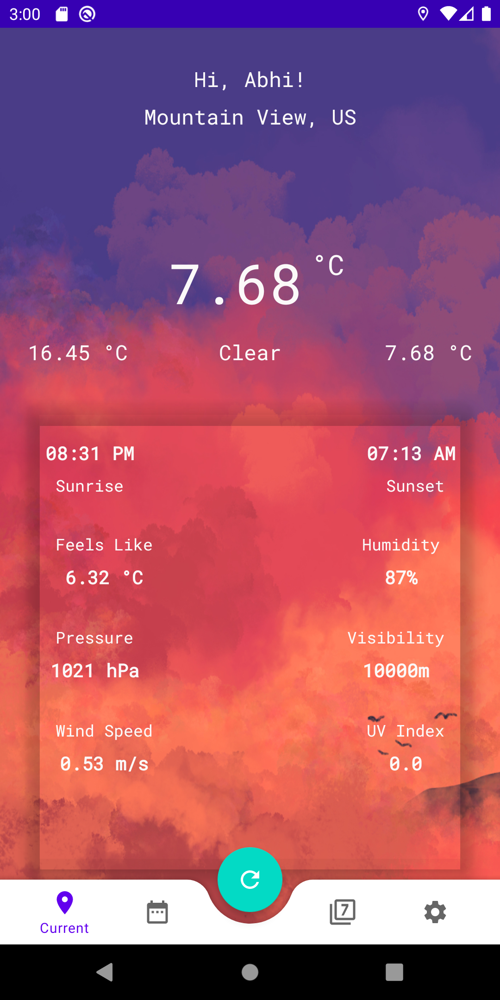
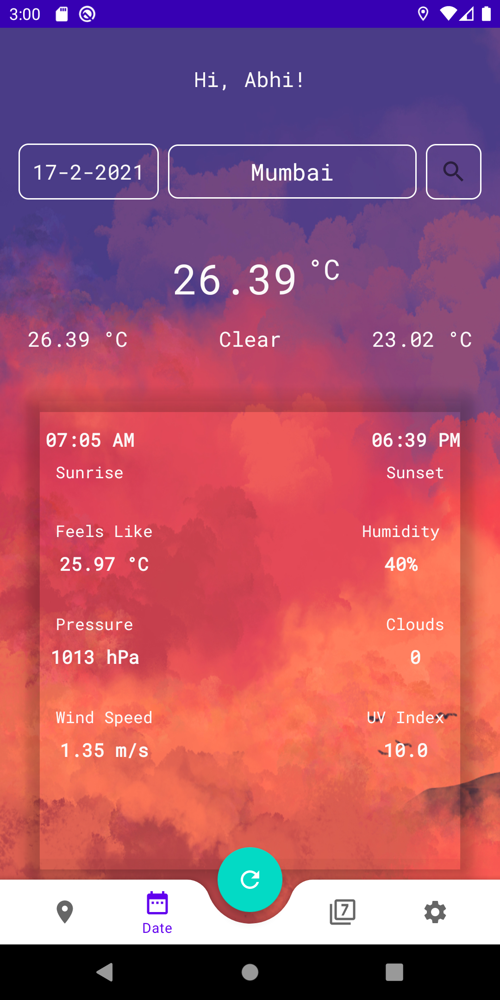
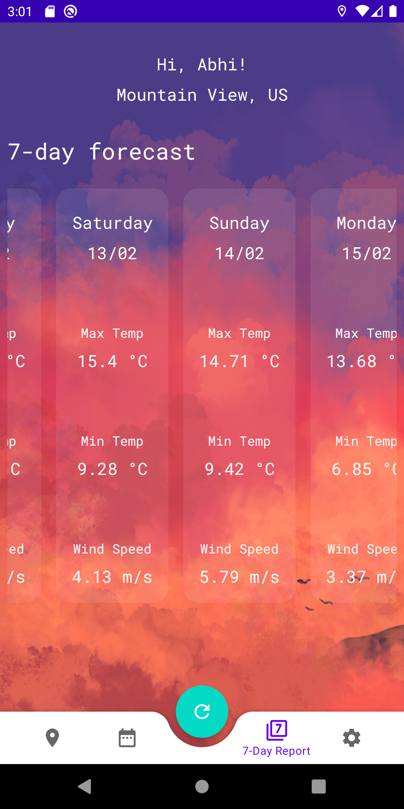
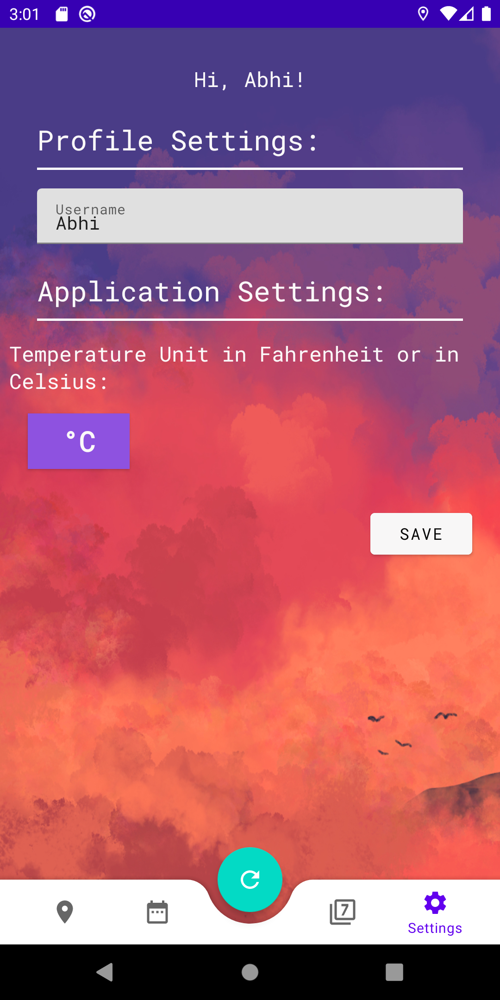

## Mausam Essence :eye_speech_bubble:
:smile: Welcome!! Mausam Essence is an interactive platform for weather forecast.</br>

## All about Mausam Essence
Prepare for your day with the most accurate current and 7-day forecasts. Stunning minimalistic photos match the time of day.

## APPLICATION DISPLAY  :eyes:	
<kbd></kbd>
<kbd></kbd>
<kbd></kbd>
<kbd></kbd>


## Getting Started :+1:

These instructions will get you a copy of the project up and running on your local machine for development and testing purposes. See deployment for notes on how to deploy the project on a live system.

### Prerequisites

What things you need to install the software and how to install them

```
Things you need to install this mobile aplication->
1. Android Mobile
That's it!
```


## Built With :heartbeat:

* Android Studio
* Kotlin


## Authors

* <a href="https://www.linkedin.com/in/abhishek-yadav-aps/"> **Abhishek Yadav** </a> 

